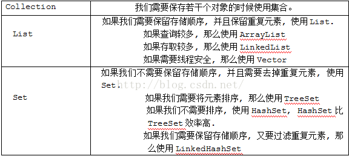

# **Compiler 2019**

Written By Xun Gong

[TOC]

## **Prepare**

### **Study *How to make a compile* **by**  青木峰郎**

> The flow of compiler is as Below:\
> 1, write antlr-g4\
> 2, write AST-builder\
> 3, write resolver and Checker\

> May optimization:\
无用代码消除\
内联转换\
内存优化\
合并IR\
循环转化\
IR向量化\
汇编代码优化

### **Study VS-Code --> JAVA, Marven, Antlr extensions.**

**change antlr4-vscode-extension**
*hwalllll*

Change antlr-extension

 newest version

<pre><code> 
> mv antlr-4.7.2-complete.jar to .vscode/extensions/mike*/antlr `and` rename it as antlr4-4.7.2-SNAPSHOT-complete.jar 
</code> </pre>

Json settings

 In Json workPlace settings

<pre><code> json
    // settings.json
    "antlr4.generation":{
        "mode": "external",
        "outputDir": "/home/xun/Documents/mxc/src/main/java/mxcompiler/parser",
        "importDir": "/home/xun/Documents/mxc/src/main/java/mxcompiler/parser/grammar",
        "package": "mxcompiler.parser",
        "language": "Java",
        "listeners": true,
        "visitors": true
    },
    // launch.json
    {
        "name": "Debug ANTLR4 grammar",
        "type": "antlr-debug",
        "request": "launch",
        "input": "src/test/cases/test.in", // test file
        "grammar": "src/main/java/mxcompiler/parser/grammar/Mx.g4", // copy-relative path
        "startRule": "start", // start rule
        "printParseTree": true,
        "visualParseTree": true
    }
</code> </pre>

antlr4 hints

 bulabula

<pre><code>
grun 之前一定记得javac *
>key word --> import, fragment, lexer, parser, grammar, returns,
locals, throws, catch, finally, mode, options, tokens
要将操作限制为生成的解析器或词法分析器，请使用@parser::name或@lexer::name。
	concluion from ASTBuilder
		1, ctx.label | ctx.parserRule()
		2, visit(ctx.xx) Deprecated visitChildren
ctrl alt - -> back (after press f12)
1 workspace is used for 1 project
which as seen may the same level as maven, springboot...
but large workspace may include diff langurages.
1, if ctx.params == null -> can not get params.param; can not use for(:)
2, if varListNode == null or varListNode.varList == null it is diff
</code> </pre>

## Part 1 Semantic Analysis

**Study for Todo File**

**get Releases from g4**
> *The Definition of Antlr4* from Antlr4.org

> This is where I get [C.g4] and [java.g4][1] 
<!-- [Download Site][^2] [Usual Way][^3]
    [^2]: https://minhaskamal.github.io/DownGit/#/home
    [^3]: Click Raw to get https://raw.githubusercontent.com/antlr/codebuff/master/corpus/antlr4/training/C.g4 -->

**struct**

- start
    - class
    - globleVarible
    - function

## **Semantic (Front End)**

### **G4-file**

Use *C.g4* and *Java.g4* as reference. Use Yikai Li g4 as reference. 

> add Class(simple)

> add *this, null, new* operator

> splite into lexis and parser files

> delete some useless parse-rule of YiKai

FIXED:

- Changed recurrence-expression into list

PS: Yikai's Tree map is non-use!!!!.

### **AST build**

Use **MxVisitor** in antlr4 to tranverse context.
Use ZhouFan's Code as reference.

> Have a hard time using ctx at first.(read offical book first!)

> Using VarDeclList as a tmp Node to get List of Node, cause visitor only return Node-type, rather than List<>

> create AST-node is a hard time, it is dull, but plenty of work.

FIXED: 

- FIXED: still can not get why to use *List<extends ?Node>*

- FIXED: Evensgn's arrayType bothers me a lot. as it is recurrence type(baseType is also may arrayType). I changed a little to support check type mode.
(However, FIX:may change into baseType+dim Mode)

### **semantic check**

- Remain many bugs: like some of my defined members are public.

- record node's location as appendix.

- add *ASTVisitor* which is useful.

- add *Scope* and *Entity* to prepare.

FIXED

- FIXED: not clear about scope, entity. However, these 2 should be seen as appendix of AST.

- FIXED: not quite clear about class-member. Add className before class-mem-func(Eversgn's Code is too long to write, but quite good to specify)

- FIXED: can not use resolver-checker mode of Japan Book, cause **Can not use before define, and there is no declaration**. So mix these 2 together.

PS: OJ is ugly with jdk-1.8 which not support Chinese letter, and do not support String.repeat bulabula, and can not use jdk-11 to run locally and then update.

PPS: TODO: Using Lianmin Zheng's arch to run test by own!!!!!

### Semi-butify codes

> change some ugly codes

> after thinking: code is always better in senior's code, may influence next few steps.

> other stu's process is so fast!!!!

## **TODO: IR**

## **TODO: CodeGen**

null check is unnecessary before instanceof

ListIterator of add, remove
each ListIterator (after function-value-pass) return a value which do not change anything(oldIter) !!!!

## register

register table

| Name | Notes                                                                                                         | Type      | 64-bitlong | 32-bitint | 16-bitshort | 8-bitchar |
|------|---------------------------------------------------------------------------------------------------------------|-----------|------------|-----------|-------------|-----------|
| rax  | Values are returned from functions in this register.                                                          | scratch   | rax        | eax       | ax          | ah and al |
| rcx  | Typical scratch register.  Some instructions also use it as a counter.                                        | scratch   | rcx        | ecx       | cx          | ch and cl |
| rdx  | Scratch register.                                                                                             | scratch   | rdx        | edx       | dx          | dh and dl |
| rbx  | Preserved register: don't use it without saving it!                                                           | preserved | rbx        | ebx       | bx          | bh and bl |
| rsp  | The stack pointer.  Points to the top of the stack (details coming soon!)                                     | preserved | rsp        | esp       | sp          | spl       |
| rbp  | Preserved register.  Sometimes used to store the old value of the stack pointer, or the "base".               | preserved | rbp        | ebp       | bp          | bpl       |
| rsi  | Scratch register used to pass function argument #2 in 64-bit Linux.  In 64-bit Windows, a preserved register. | scratch   | rsi        | esi       | si          | sil       |
| rdi  | Scratch register and function argument #1 in 64-bit Linux.  In 64-bit Windows, a preserved register.          | scratch   | rdi        | edi       | di          | dil       |
| r8   | Scratch register.  These were added in 64-bit mode, so they have numbers, not names.                          | scratch   | r8         | r8d       | r8w         | r8b       |
| r9   | Scratch register.                                                                                             | scratch   | r9         | r9d       | r9w         | r9b       |
| r10  | Scratch register.                                                                                             | scratch   | r10        | r10d      | r10w        | r10b      |
| r11  | Scratch register.                                                                                             | scratch   | r11        | r11d      | r11w        | r11b      |
| r12  | Preserved register.  You can use it, but you need to save and restore it.                                     | preserved | r12        | r12d      | r12w        | r12b      |
| r13  | Preserved register.                                                                                           | preserved | r13        | r13d      | r13w        | r13b      |
| r14  | Preserved register.                                                                                           | preserved | r14        | r14d      | r14w        | r14b      |
| r15  | Preserved register.                                                                                           | preserved | r15        | r15d      | r15w        | r15b      |
[Refer][register-web]

> 64 bit linux machine: rdi, rsi, rdx, rcx, r8, and r9. Any additional parameters get pushed on the stack.

[Register Usage](https://www.freepascal.org/docs-html/current/prog/progse20.html#x160-1610006.1)

[Asm-Insts](https://cs.lmu.edu/~ray/notes/nasmtutorial/)

retainAll -> remove others
stream.filter -> still have others

https://www.zhihu.com/question/29355187

# -DTest=

[register-web]: https://www.cs.uaf.edu/2017/fall/cs301/reference/x86_64.html
[C.g4]: https://github.com/antlr/codebuff/blob/master/corpus/antlr4/training/C.g4
[1]: https://github.com/antlr/codebuff/blob/master/corpus/antlr4/training/java.g4

